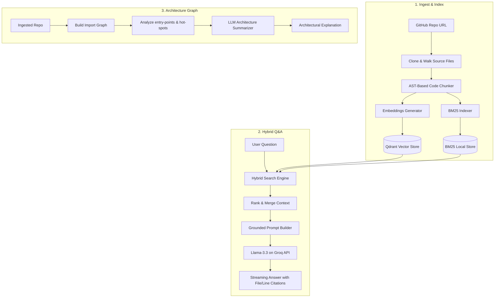

# 🧠 Repo Intelligence Agent — Phase 1

<p align="center">
  
  
  
  
  
</p>

---

## 📖 Overview
The **Repo Intelligence Agent** is an advanced code-aware Q&A system designed to help developers, architects, and new contributors understand complex codebases. It automatically ingests files from GitHub, structures code into logical blocks using **Abstract Syntax Tree (AST)** chunking, indexes files using a **Hybrid Retrieval (Vector DB + BM25)** engine, builds a local **Import Dependency Graph**, and streams architectural explanations and line-by-line grounded answers using **Groq (Llama-3.3-70b)**.

> [!IMPORTANT]
> This system is built to minimize LLM hallucinations. All Q&A answers are strictly grounded in retrieved code excerpts and cite exact filenames and line numbers.

---

## 🏗️ Architecture Flow

The workflow below illustrates the pipeline from repository ingestion to hybrid retrieval and question answering:



---

## 🛠️ Folder Structure

```directory
.
├── .env.example              # Template environment configurations
├── .gitignore                # Git ignore patterns
├── docker-compose.yml        # Multi-container orchestration (FastAPI + Qdrant)
├── README.md                 # Project guide and documentation
├── data/
│   └── repos/                # Local directory checkouts (cloned repos)
└── backend/
    ├── Dockerfile            # Container build for FastAPI app
    ├── requirements.txt      # Python dependencies
    └── app/
        ├── __init__.py
        ├── main.py           # FastAPI server and endpoints declaration
        ├── config.py         # Configs (keys, endpoint configurations)
        ├── agents/
        │   └── repo_qa_agent.py   # RAG agent prompt context assembly
        ├── chunking/
        │   ├── ast_chunker.py     # Python AST parser (functions & classes)
        │   └── chunk_models.py    # Chunk schema representations
        ├── graph/
        │   └── import_graph.py    # Lightweight module import dependency analyzer
        ├── ingestion/
        │   └── github_fetch.py    # Git operations (clone, pull, walk)
        ├── llm/
        │   └── llm_client.py      # Streaming Groq API client (Llama-3.3-70b)
        └── retrieval/
            ├── bm25_index.py      # Lexical / keyword index builder
            ├── embeddings.py      # Sentence-Transformer embeddings
            ├── hybrid_search.py   # Hybrid reciprocal rank fusion (RRF) ranker
            └── vector_store.py    # Vector database client & management
```

---

## 🚀 Getting Started

Follow these steps to spin up and run the Repo Intelligence Agent on your machine.

### Prerequisites
- [Docker](https://www.docker.com/) and Docker Compose installed.
- A **Groq API Key** (Get one from [Groq Console](https://console.groq.com/)).
- A **GitHub Personal Access Token** (optional, recommended to avoid rate limits).

### Setup Steps

1. **Clone the repository** (if not already done):
   ```bash
   git clone https://github.com/bhagy-patel1/repo-intel-agent.git
   cd repo-intel-agent
   ```

2. **Configure Environment Variables**:
   Copy `.env.example` into a new `.env` file:
   ```bash
   cp .env.example .env
   ```
   Open the `.env` file and insert your API keys:
   ```env
   GROQ_API_KEY=gsk_your_groq_api_key_here
   GITHUB_TOKEN=ghp_your_github_token_here
   ```

3. **Start the containers**:
   Launch FastAPI and the Qdrant database:
   ```bash
   docker compose up --build
   ```
   *The server will start listening at `http://localhost:8000`.*

---

## 🔌 API Endpoints Reference

The backend exposes three main endpoints. Below are details on request parameters and expected structures.

### 1. Ingest a Repository (`POST /ingest`)
Clones the target repository, parses all source code, computes embeddings, and builds the local lexical indexes.

* **Payload Parameters**:
| Parameter | Type | Required | Description |
| :--- | :--- | :--- | :--- |
| `repo_url` | `string` | Yes | The HTTPS clone URL of the GitHub repository. |
| `repo_id` | `string` | Yes | A unique identifier of your choice to label this repository database collection. |

* **Example Request**:
```bash
curl -X POST http://localhost:8000/ingest \
  -H "Content-Type: application/json" \
  -d '{"repo_url": "https://github.com/fastapi/fastapi", "repo_id": "fastapi"}'
```

* **Example Response**:
```json
{
  "repo_id": "fastapi",
  "chunks_indexed": 1420
}
```

---

### 2. Ask Code Questions (`POST /ask`)
Asks questions about the codebase. Answers are streamed back chunk-by-chunk in real time.

* **Payload Parameters**:
| Parameter | Type | Required | Description |
| :--- | :--- | :--- | :--- |
| `repo_id` | `string` | Yes | The repository identifier used during `/ingest`. |
| `question` | `string` | Yes | The architecture or programming question you want to ask. |

* **Example Request**:
```bash
curl -X POST http://localhost:8000/ask \
  -H "Content-Type: application/json" \
  -d '{"repo_id": "fastapi", "question": "Where is the router prefix defined?"}'
```

* **Example Output (Streams)**:
> Based on the file [fastapi/routing.py](file:///data/repos/fastapi/fastapi/routing.py#L90-L105), the router prefix is configured in the `APIRouter` class initialization. Specifically:
> ```python
> class APIRouter:
>     def __init__(self, prefix: str = "", ...):
>         self.prefix = prefix
> ```

---

### 3. Generate Architecture Overview (`POST /architecture`)
Analyzes module-level import hierarchies and code entry points to construct a comprehensive architecture overview.

* **Payload Parameters**:
| Parameter | Type | Required | Description |
| :--- | :--- | :--- | :--- |
| `repo_id` | `string` | Yes | The repository identifier used during `/ingest`. |

* **Example Request**:
```bash
curl -X POST http://localhost:8000/architecture \
  -H "Content-Type: application/json" \
  -d '{"repo_id": "fastapi"}'
```

* **Example Response**:
```json
{
  "architecture_summary": "The fastapi repository functions as an ASGI framework... The entry points are concentrated in `fastapi/applications.py`, where the main `FastAPI` instance is defined. Sub-modules like `routing.py` handle request mapping, while `params.py` and `datastructures.py` manage validation. Core dependencies flow into dependency injection resolvers."
}
```

---

## ⚡ Tech Stack & Engineering Details

* **Lexical + Vector Hybrid Search**: We utilize Reciprocal Rank Fusion (RRF) to combine keyword matches from a local **BM25 Index** with semantic embeddings retrieved from **Qdrant Vector Store** (`all-MiniLM-L6-v2` running locally).
* **AST Code Chunking**: Rather than splitting source code by raw characters, the agent targets logical units (classes, functions, decorators) using custom Abstract Syntax Tree parsing (`backend/app/chunking/ast_chunker.py`), ensuring that blocks of code retain context.
* **Stream Processing**: Streaming responses from Groq are delivered directly to clients using FastAPI's `StreamingResponse`, reducing time-to-first-token.
